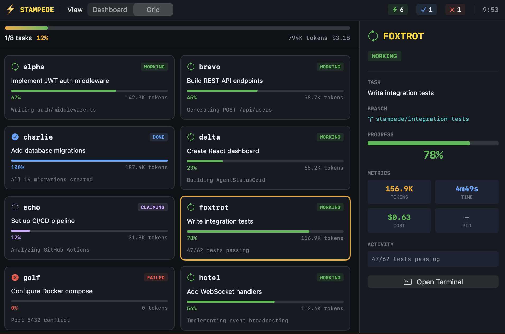

# ⚡ Stampede App

**Native macOS companion for [Terminal Stampede](https://github.com/DUBSOpenHub/terminal-stampede).**

A SwiftUI dashboard that monitors your multi-agent orchestration runs in real time. Gold-on-dark design, menu bar integration, keyboard shortcuts — all reading the same filesystem IPC that Stampede already uses.

  


*8 agents working in parallel — grid view with agent detail panel, live progress, token tracking*

## Quick Start

```bash
git clone https://github.com/DUBSOpenHub/stampede-app.git
cd stampede-app
swift build
open "$(swift build --show-bin-path)/StampedeUI"
```

## What You Get

- **Dashboard view** — table layout with agent status, progress bars, token counts, elapsed time
- **Grid view** — card-based layout for visual monitoring
- **Agent detail panel** — click any agent to see branch, metrics, activity, and actions
- **Menu bar extra** — ⚡ icon with fleet status dropdown, always visible
- **Conflict warnings** — banner when agents touch the same files
- **Keyboard shortcuts** — ⌘1-9 focus agents, ⌘] / ⌘[ navigate, ⇧⌘R retry failed
- **Preferences** — configurable directory, refresh rate, max agents, notifications

## Design System

Gold-on-dark palette built for the terminal aesthetic:

| Token | Hex | Use |
|-------|-----|-----|
| `gold` | `#F5A623` | Brand accent, progress bars, glow |
| `bgDeep` | `#0D1117` | Primary background (GitHub dark) |
| `green` | `#3FB950` | Working / active agents |
| `blue` | `#58A6FF` | Completed agents |
| `red` | `#F85149` | Failed agents |
| `orange` | `#F0883E` | Conflicts / warnings |
| `purple` | `#D2A8FF` | Claiming / acquiring tasks |

Shared design tokens live in [terminal-stampede/ui/tokens/](https://github.com/DUBSOpenHub/terminal-stampede/tree/main/ui/tokens) for parity with the terminal dashboard.

## How It Works

The app reads Terminal Stampede's filesystem IPC — the same files the agents use:

```
$STAMPEDE_DIR/
├── fleet.json      → agent roster
├── pids/           → running processes
├── claimed/        → active tasks
├── queue/          → pending tasks
└── results/        → completed work
```

No servers. No sockets. Just file watching. Point it at your Stampede run directory in Preferences.

## Requirements

- macOS 13 (Ventura) or later
- Swift 5.9+ / Xcode 15+ command line tools
- [Terminal Stampede](https://github.com/DUBSOpenHub/terminal-stampede) running a job

## License

MIT — same as Terminal Stampede.

---

🐙 Created with 💜 by [@DUBSOpenHub](https://github.com/DUBSOpenHub) with the [GitHub Copilot CLI](https://docs.github.com/copilot/concepts/agents/about-copilot-cli).

Let's build! 🚀✨
